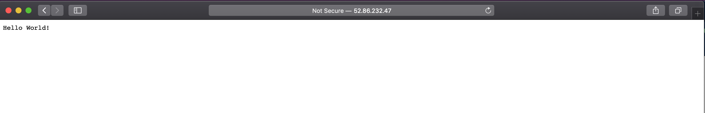

# IaC (infrastructure-as-code)

This repository contains sub components to bring up `Node.js` web application in AWS Infrastructure. 

<!-- TABLE OF CONTENTS -->
## Table of Contents

* [nodejs-hello-world](#nodejs-hello-world)
* [Packer](#packer)
* [Terraform](#terraform)
* [CI/CD](#ci/cd)
* [Demo](#demo)
  

<!-- ABOUT THE PROJECT -->
### nodejs-hello-world

This folder [nodejs-hello-world](https://github.com/Ksreenivas/nodejs-application/tree/main/nodejs-hello-world) contains a sample node.js web applicaiton.

* hello world node.js [application](https://github.com/Ksreenivas/nodejs-application/tree/main/nodejs-hello-world/src)
* [Dockerfile](https://github.com/Ksreenivas/nodejs-application/blob/main/nodejs-hello-world/Dockerfile) to build docker image.
* [Jenkinsfile](https://github.com/Ksreenivas/nodejs-application/blob/main/nodejs-hello-world/Jenkinsfile) contains a sequence of instructions to create a Jenkins Pipeline.
* [Readme.md](https://github.com/Ksreenivas/nodejs-application/blob/main/nodejs-hello-world/README.md)

### Packer

This folder [packer](https://github.com/Ksreenivas/nodejs-application/tree/main/packer) contains packer template JSON file to create UBUNTU AMI for WEB Application.

* [JSON-template](https://github.com/Ksreenivas/nodejs-application/blob/main/packer/hello-world.json) - Packer json template to create ubuntu AMI for nodejs applicaiton.
* [Provisioners](https://github.com/Ksreenivas/nodejs-application/blob/main/packer/install-docker.sh) - Provisoner file will install docker and build docker image locally with node.js application.
* [Jenkinsfile](https://github.com/Ksreenivas/nodejs-application/blob/main/packer/Jenkinsfile) contains a sequence of instructions to create a Jenkins Pipeline.
* [Readme.md](https://github.com/Ksreenivas/nodejs-application/blob/main/packer/README.md)

### Terraform

This folder [Terraform](https://github.com/Ksreenivas/nodejs-application/tree/main/terraform) contains terraform files to bring up EC2 instance and security group.

[nodejs-terraform-module](https://github.com/Ksreenivas/nodejs-application/tree/main/terraform/nodejs-module) - This module get the values from [main.tf](https://github.com/Ksreenivas/nodejs-application/blob/main/terraform/main.tf#L36)

* [Makefile](https://github.com/Ksreenivas/nodejs-application/blob/main/terraform/Makefile) Instructions to bring up infrastructure `make init`, `make plan`, `make apply`
* [user-data.sh](https://github.com/Ksreenivas/nodejs-application/blob/main/terraform/nodejs-module/user-data.sh) Instructions to bring docker container with node.js application.
* [Jenkinsfile](https://github.com/Ksreenivas/nodejs-application/blob/main/terraform/Jenkinsfile) contains a sequence of instructions to create a Jenkins Pipeline.
* [Readme.md](https://github.com/Ksreenivas/nodejs-application/blob/main/terraform/README.md) 
* [terraform-log-creation-deletion](https://github.com/Ksreenivas/nodejs-application/tree/main/terraform/log)

### CI/CD

This [CI/CD](https://github.com/Ksreenivas/nodejs-application/tree/main/ci_cd-pipeline/jobDSL) folder creates [seed](https://github.com/Ksreenivas/nodejs-application/blob/main/ci_cd-pipeline/jobDSL/seedPipeline.groovy) Job and scans and create `MultiBranchPipeline` job from Jenkinsfile.

<!-- USAGE EXAMPLES -->
## Usage

Dive into each folder's `README.md` file to have your node.js web application created.

### Demo

